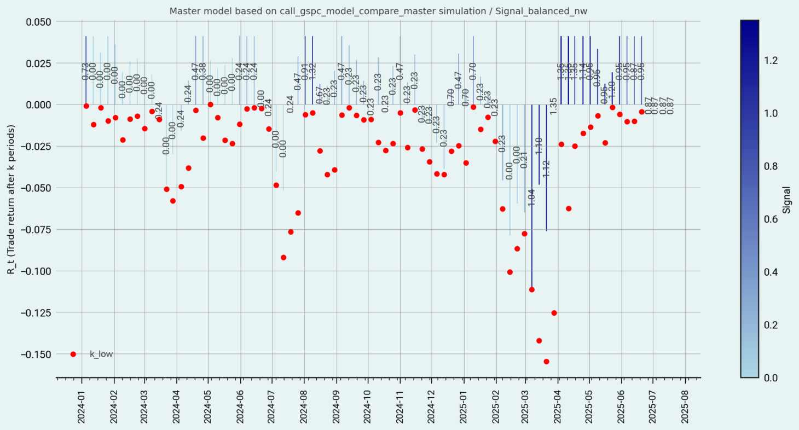
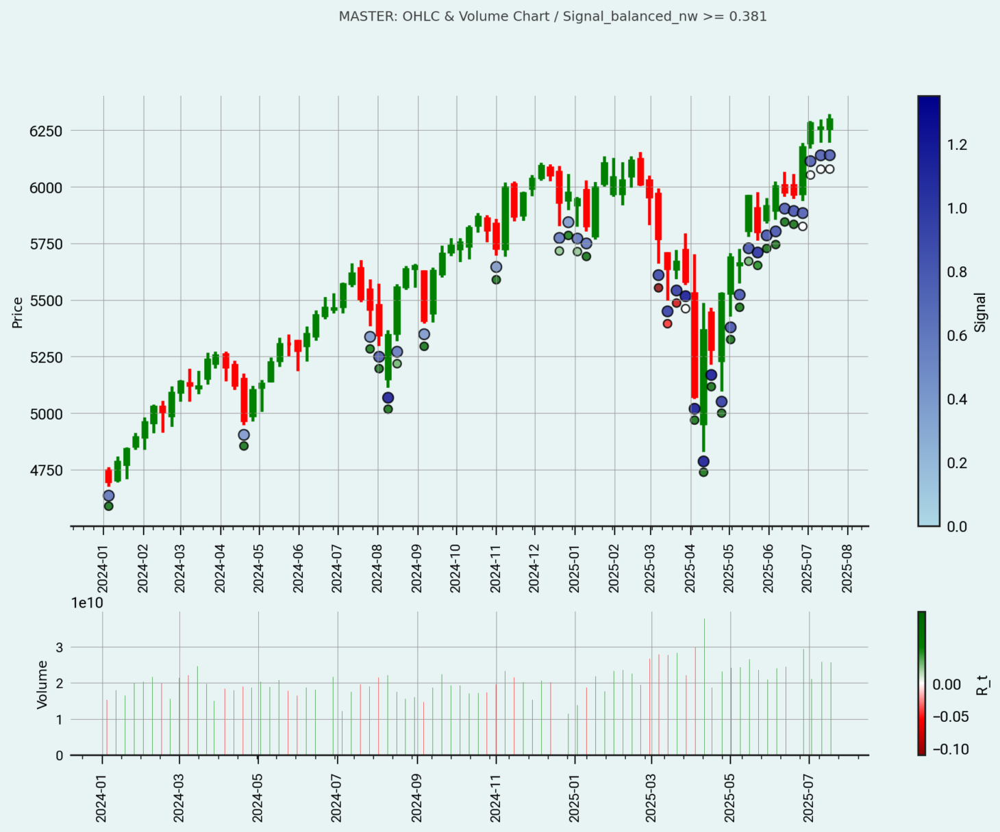
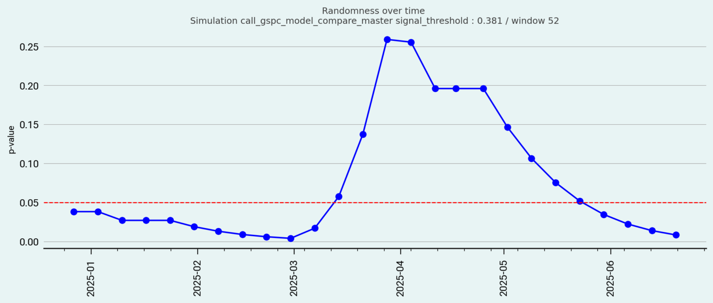
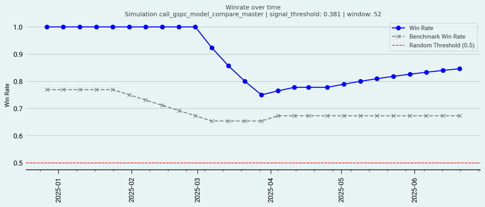
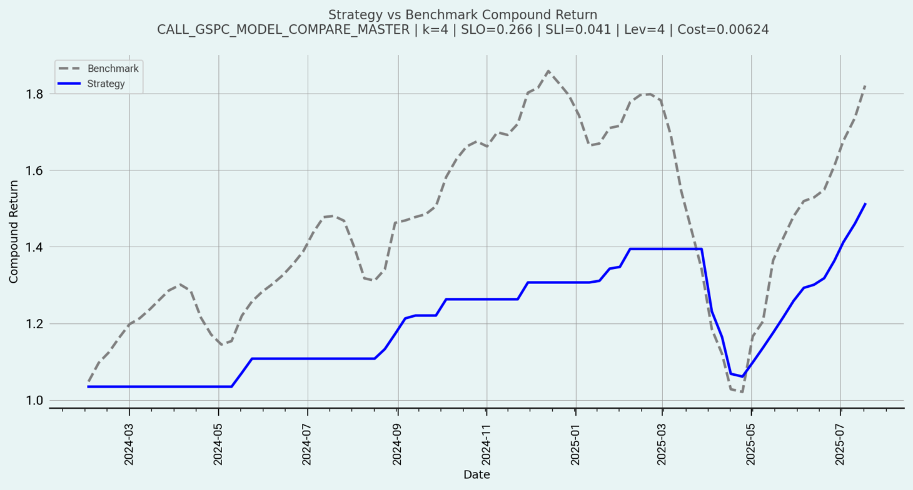
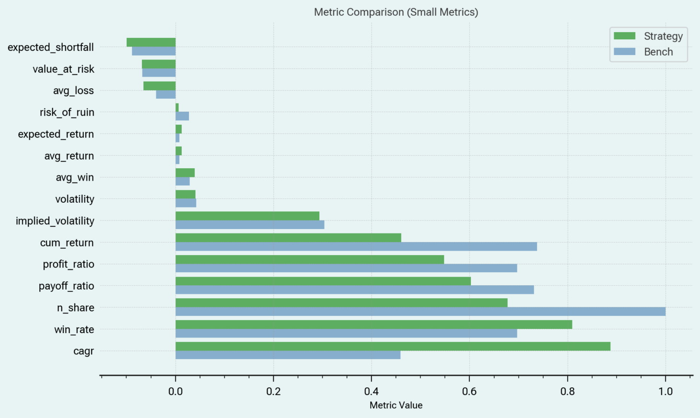
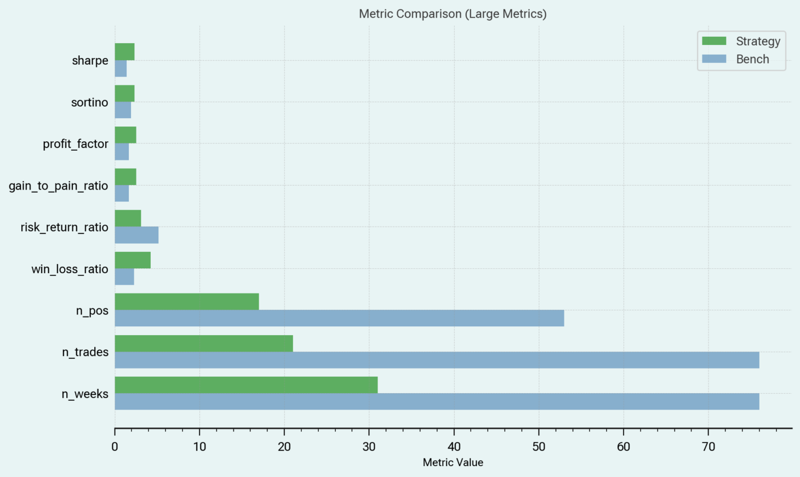

# TheBeenProject 🐝💡📊

**TheBeenProject** is a research project exploring AI-driven trading strategies, inspired by bee foraging behavior. It is not intended for commercial use. The repository is only used for **Streamlit**-based interactive analytics dashboard for evaluating options strategies.

🚀 **Launch the App**:  
👉 [Click here to open in Streamlit](https://thebeenproject-c5zp7sqjx7s56jw9br7h8g.streamlit.app)

---

## 🔍 Features

- Strategy backtesting (Calls & Puts)
- Performance metrics (CAGR, Sharpe, Sortino, VaR, etc.)
- Custom leverage, slippage, and stop-loss inputs
- Benchmarks comparison
- Interactive charts 

## 📦 Technologies Used

- Python (Pandas, NumPy)
- Streamlit
- Matplotlib / Plotly
- Scikit-learn (optional models)

## 🚧 Setup & Run Locally

```bash
pip install -r requirements.txt
streamlit run app.py
```

## 📸 App Demo Screenshots

Here’s a walkthrough of the app interface and its features:

### Step 1 / Signals



### Step 2 / Signals and candles 



### Step 3 / Signal Randomness

 

### Step 4 / Signals Winrate



### Step 5 / Performance



### Step 6 / Performance metrics



### Step 7 / Performance metrics




